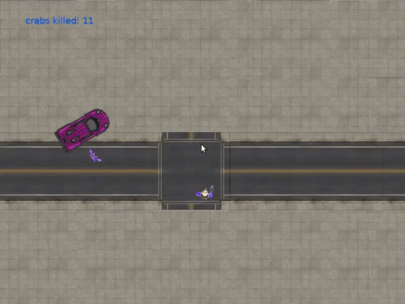

# crabkill

### how to play

- Install `love` from [https://love2d.org/](https://love2d.org/) or `apt-get install love`
- Clone this repository `git clone https://github.com/crabkill/crabkill.git`
- Run the game with love2d `love crabkill`

### contributors
[@iurantr](https://github.com/iurantr), [@magiccookie](https://github.com/magiccookie)

### credits
- love2d game engine [https://love2d.org/](https://love2d.org/)
- textures [https://www.sketchuptextureclub.com/](https://www.sketchuptextureclub.com/)
- McLaren F1 pixel art work (c) Michał Kalinowski [link](http://index.artstation.com/artwork/aeJ59)
- shooting sound from [https://freesound.org/](https://freesound.org/)
